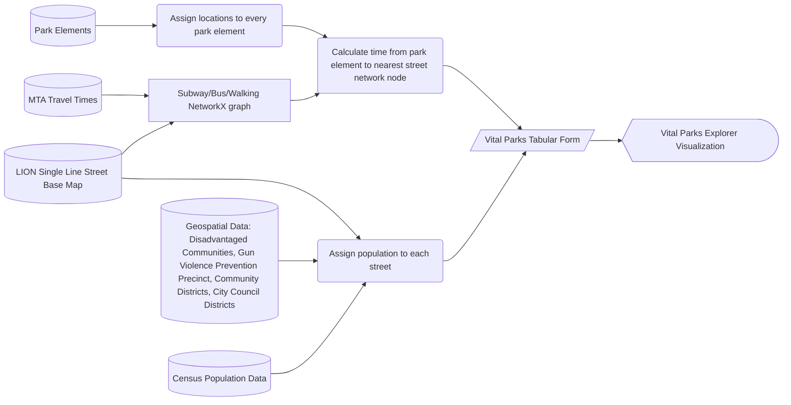

# General Info
Please note that some datasets may not perfectly align with the website due to processing delays as we continue to enhance our Open Data pipelines.

We strive to maintain up-to-date and accurate data on our website. However, if you notice any discrepancies, please [email us](https://a860-openrecords.nyc.gov/) so we can address them. 

> [!NOTE]
>**Up to Date** datasets are current and regularly maintained.  
**In Progress** datasets are undergoing active updates or improvements but are not yet fully up to date.  
**Limited Updates** are datasets that are updated infrequently or only under specific conditions. Updates depend on available resources and operational priorities, so datasets may not be fully up to date.  
**Coming Soon** are datasets that are actively being worked upon to upload to Open Data. 

<!--- **Not Maintained** datasets are outdated with no active updates, though we hope to update them if resources allow. -->

# Data
## Vital Parks Explorer Element by Dataset

| Vital Parks Explorer Element | Dataset Type | Public Dataset | 
| --- | --- | --- | 
| Active Recreation Areas | Raw Data | <ul><li>[Athletic Facilities](https://data.cityofnewyork.us/dataset/Athletic-Facilities/qnem-b8re/about_data) (Up to Date)</li><li>[Skate Parks](https://data.cityofnewyork.us/City-Government/DPR_Skateparks_001/8knb-zsb6/about_data) (Limited  Updates)</li></ul>  | <ul><li>Up to Date</li><li>Limited Updates</li></ul> |
| Community Gardens | Raw Data | <ul><li>[GreenThumb Garden Info](https://data.cityofnewyork.us/dataset/GreenThumb-Garden-Info/p78i-pat6/about_data) (Up to Date)</li> | <ul><li>Up to Date</li></ul> |
| Cooling Features | Raw Data | <ul><li>[NYC Parks Drinking Fountains](https://data.cityofnewyork.us/Recreation/NYC-Parks-Drinking-Fountains/qnv7-p7a2/about_data) (In Progress) </li><li>[NYC Parks Spray Showers](https://data.cityofnewyork.us/Recreation/NYC-Parks-Spray-Showers/ckaz-6gaa/about_data) (In Progress)</li></ul> | <ul><li>In Progress</li><li>In Progress</li></ul> |
| Dog Runs | Raw Data | <ul><li>[Dog Runs](https://data.cityofnewyork.us/Recreation/Dog-Runs/hxx3-bwgv/about_data) (Limited Updates)</li></ul> |<ul><li>Limited Updates</li></ul> |
| Forever Wild Natural Areas | Raw Data | <ul><li>[NYC Parks Forever Wild](https://data.cityofnewyork.us/Environment/NYC-Parks-Forever-Wild/48va-85tp/about_data) (Up to Date)</li></ul>  | <ul><li>Limited Updates</li></ul> |
| Greenways | Raw Data | Coming Soon | <ul><li>Coming Soon</li></ul> |
| Hiking Trails | Raw Data | <ul><li>[Parks Trails](https://data.cityofnewyork.us/Environment/Parks-Trails/vjbm-hsyr/about_data) (Up to Date)</li></ul> | <ul><li>Limited Updates</li></ul> |
| Nature Centers | Raw Data | <ul><li>[NYC Parks Structures](https://data.cityofnewyork.us/dataset/NYC-Parks-Structures/n8q6-i44s/about_data) (Up to Date)</li></ul> | <ul><li>Up to Date</li></ul>|
| New or Renovated Parks | Raw Data | <ul><li>[Capital Project Tracker](https://data.cityofnewyork.us/Recreation/Capital-Project-Tracker/4hcv-tc5r/about_data) (Up to Date) </li></ul> | Up to Date 
| Park Partner Groups | Raw Data | <ul><li>Partnerships for Parks (Coming Soon)</li><li>Natural Resources Group (Coming Soon)</li><li>[Volunteering Groups](https://www.nycgovparks.org/bigapps/DPR_VolunteeringGroups_001.json) (Coming Soon[1](#myfootnote1))</li></ul>| <ul><li>Coming Soon</li><li>Coming Soon</li></ul>|
| Parks Enforcement Patrol | Raw Data | Coming Soon | <ul><li>Coming Soon</li></ul>|
| [Parks With High Condition Scores](https://github.com/NYC-Parks/park_score) | Aggregated Metrics |Coming Soon  | Coming Soon |
| Playgrounds | Raw Data | <ul><li>[Children's Play Areas](https://data.cityofnewyork.us/Recreation/Children-s-Play-Areas-CPAs-/j55h-3upk/about_data) (In Progress)</li></ul>  | In Progress |
| Public Events | Raw Data | <ul><li>[Events Calendar Count - past 365 days](https://www.nycgovparks.org/bigapps/DPR_PastYearEventCounts_001.json) (Coming Soon[1](#myfootnote1))</li><li>[Events Calendar Count - upcoming 90 days](https://www.nycgovparks.org/bigapps/DPR_UpcomingEventCounts_001.json) (Coming Soon[1](#myfootnote1)) </li></ul> | Coming Soon to Open Data, but dataset is maintained |
| Public Restrooms | Raw Data | <ul><li>[NYC Parks Structures](https://data.cityofnewyork.us/dataset/NYC-Parks-Structures/n8q6-i44s/about_data) (Up to Date)</li></ul> | Up to Date |
| Recreation Centers | Raw Data | <ul><li>[NYC Parks Structures](https://data.cityofnewyork.us/dataset/NYC-Parks-Structures/n8q6-i44s/about_data) (Up to Date)</li></ul> | In Progress |
| Street Trees | Aggregated Metrics | Not applicable | <ul><li>Coming Soon</li></ul> |
| Swimming Facilities | Raw Data | <ul><li>[NYC Parks Pools](https://data.cityofnewyork.us/Recreation/NYC-Parks-Pools/y5rm-wagw/about_data) (Up to Date)</li><li>[Beaches](https://data.cityofnewyork.us/dataset/Beaches/ijwa-mn2v/about_data) (Up to Date)</li></ul> | Up to Date|
| Tree Canopy Cover | Aggregated Metrics | Not applicable | <ul><li>Coming Soon</li><li>Coming Soon</li><li>Coming Soon</li></ul>|
| Volunteer Events | Raw Data | <ul><li>[Volunteer Events - past 365 days](https://www.nycgovparks.org/bigapps/DPR_Volunteer_Events_past_365_days_001.json) (Coming Soon[1](#myfootnote1))</li><li>[Volunteer Events - upcoming 90 days](https://www.nycgovparks.org/bigapps/DPR_Volunteer_Events_upcoming_90_days_001.json) (Coming Soon[1](#myfootnote1)) </li></ul> | Coming Soon to Open Data, but dataset is maintained |
| Waterfronts | Raw Data | Coming Soon | Up to Date |

## Non-Parks Data

| Data Component  | Public Dataset | 
| --- | --- | 
| Walkable Street Data | <ul><li>[LION Single Line Street Base Map](https://www.nyc.gov/site/planning/data-maps/open-data/dwn-lion.page)</li></ul>  | <ul><li>Up to Date</li><li>Not Maintained</li></ul> |
| MTA Subway/Bus Travel Times | <ul><li>[MTA Developer Resources](https://www.mta.info/developers)</li><li>[MTA General Transit Feed Specifications](https://data.ny.gov/Transportation/MTA-General-Transit-Feed-Specification-GTFS-Static/fgm6-ccue/about_data)</li></ul> | <ul><li>Up to Date</li><li>Not Maintained</li></ul> |
| Census Population Statistics | <ul><li>[Total Population](https://data.census.gov/table/DECENNIALPL2020.P1)</li></ul> | <ul><li>Up to Date</li><li>Not Maintained</li></ul> |
| Geospatial Data | <ul><li>[City Council District](https://www.nyc.gov/site/planning/data-maps/open-data/districts-download-metadata.page)</li><li>[Community Districts](https://data.cityofnewyork.us/City-Government/2020-Community-District-Tabulation-Areas-CDTAs-/xn3r-zk6y/about_data)</li><li>[Disadvantaged Communities](https://data.ny.gov/Energy-Environment/Final-Disadvantaged-Communities-DAC-2023/2e6c-s6fp/about_data)</li><li>[Police Precincts](https://data.cityofnewyork.us/City-Government/Police-Precincts/y76i-bdw7/about_data)</li></ul> | <ul><li>Up to Date</li><li>Not Maintained</li></ul> |

# Process Overview

## Vital Parks Tabular Form

_This is a sample and does not represent accurate data._

| seg_ID    | population | census_tract | (other geopatial data) | swimming_facility$travel_mode:WALK (min) | swimming_facility$travel_mode:MTA (min) | (other park features) |
| ---      | ---       | --- | --- | --- | --- | --- | 
| 0111206L | 50         | 61021000 | ... | 97 | 40 | ... |  
| 0111206R | 54         | 61021000 | ... | 97 | 41 | ... |  
| 0020981L     |  0 |  47008400      | ... | 10 | 10 | ... |
| 0020981R    |  0 |  47008400       | ... | 10 | 10 | ... |
| 0020848L     |  63 |  47008200      | ... | 300 | 74 | ... |
| 0020848R    |  0 |  47008200       | ... | 300 | 73 | ... |

---

<a name="myfootnote1">1</a>: Coming Soon to Open Data but maintained on Parks Website
